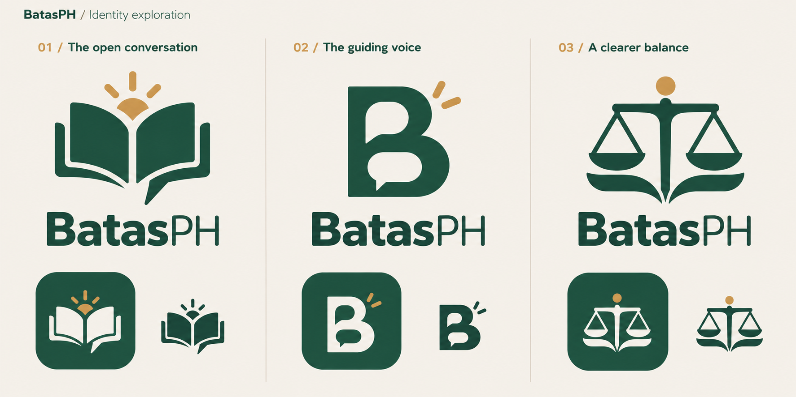

# BatasPH logo concepts

Concept board generated with the built-in image-generation tool. Each direction shows a primary logo, wordmark and launcher-icon treatment. These are exploration previews, not final production icon exports. Existing app assets have not been replaced.

1. **The open conversation:** an open book, conversation tail and sun accent. Recommended for continuity with the existing legal-knowledge identity and the voice-call experience.
2. **The guiding voice:** a compact B monogram incorporating conversation shapes.
3. **A clearer balance:** simplified justice scales with an open-book base.

The selected direction will extend to Android launcher/adaptive icons, iOS icons, splash branding, in-app branding and the Play Store icon. Final output should use consistent geometry, transparent standalone marks and opaque store-icon exports.

## Generation prompt

Use case: logo-brand. Create ONE beautifully art-directed flat brand exploration board for BatasPH, a Philippine legal-information app centered on voice calls with an AI legal guide. This single comparison board shows THREE distinct coordinated logo concepts, each with its own wordmark lockup and matching Android launcher icon preview. Landscape composition, warm ivory background #F5F1EA, generous whitespace, fine subtle vertical separators dividing three equal columns, precise grid and premium graphic-design presentation. All typography crisp. Small upper-left heading 'BatasPH / Identity exploration'. Palette deep forest green #1F4D3F, warm ivory #F5F1EA, restrained amber #C8964F. Existing mark is an ornate gold open book with justice scales, Philippine sun and speech tail; improve it into much simpler iconic geometry that reads clearly at 24 pixels. Entire output flat vector-like branding, not metallic, not 3D, no gradients, no bevels, no mockup scenery. Each column: small number and direction name at top, a large free-standing symbol in center, strong refined sans-serif wordmark 'BatasPH' below symbol, then lower down a rounded-square launcher icon with the SAME symbol centered at a comfortable adaptive-icon safe size on solid forest-green background, and beside it a small monochrome version of the symbol to demonstrate small-size clarity. Match icons to the main symbols exactly. COLUMN 1 label '01 / The open conversation': original memorable symbol combining two broad open-book pages with a subtly integrated speech-bubble tail, just two or three bold clean shapes and generous negative space. Tiny amber rising-sun accent above the center crease (simple semicircle and three rays, not a complex seal). Forest mark on ivory, ivory mark on forest launcher tile with same amber accent. Elegant approachable and distinctive. COLUMN 2 label '02 / The guiding voice': compact custom uppercase B monogram, rounded architectural curves, its two bowls cleverly suggest a conversation bubble, one simple amber sun dot or short amber ray accent in upper right. Abstract but unmistakably B. No tiny detail. Forest on ivory, inverted ivory on forest launcher tile. COLUMN 3 label '03 / A clearer balance': very simplified justice scales whose balanced bowls and beam also evoke an open book, a small amber circle crowning the central stem, broad geometry and rounded terminals, no shield or enclosing badge. Forest on ivory, inverted ivory on forest launcher tile. Wordmark in all concepts sophisticated rounded humanist sans-serif with precise kerning, 'Batas' heavier and 'PH' slightly lighter but same baseline and size. Prioritize beautiful proportion, geometric rigor, legal trust and conversational warmth. No government seal, no stock clipart, no gavel, no portrait, no flag, no extra slogans, no textures, no shadows. Clear practical branding directions suitable to carry through app launcher, splash screen, in-app wordmark and Play Store icon. Include only specified text, exact spelling BatasPH.
