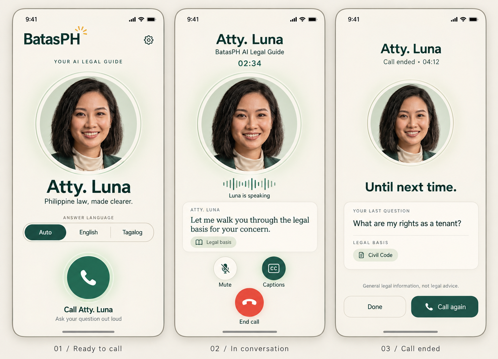

# BatasPH call screen design concept

The approved concept is now implemented in Flutter. See [rendered implementation previews](design-previews/README.md) for the actual Home, active-call and ended-call layouts.

The direction preserves the mobile phone call experience: a prominent Luna portrait, contact name, call timer, circular mute and captions controls, and a recognizable red hang-up button. Warm ivory, forest green, soft sage rings, clearer typography, and generous spacing refine the existing identity.

## Screens

1. **Ready to call:** Luna's portrait, answer-language selector, settings shortcut, and a large circular Call button.
2. **In conversation:** contact identity and timer, portrait with speaking indicator, a caption card, mute and captions controls, and End call.
3. **Call ended:** duration, last question and legal-basis labels, disclaimer, Done, and Call again.

The example question and citation are illustrative layout content. This concept does not add full conversation history or an answer summary. The speaking waveform is a proposed visual status indicator, not a claim that live amplitude data is currently exposed. Final icons should make mute status unambiguous.

## Generation

Generated with the built-in image-generation tool using `assets/images/avatars/luna_face.jpg` as the portrait reference.

Prompt specification: Create a polished landscape board with three complete, front-facing portrait mobile UI mockups for BatasPH: Ready to call, In conversation, and Call ended. Preserve the familiar phone-call layout and the reference portrait's identity. Use warm ivory #F5F1EA, deep forest #1F4D3F, restrained sage portrait rings, subtle amber accents, clear typography, generous spacing, and consistent margins. Home contains BatasPH, settings, Atty. Luna, Auto/English/Tagalog answer-language choices, and a circular green Call action. The active call contains Atty. Luna, a timer, portrait, speaking indicator, caption card, circular Mute and Captions controls, and a circular red End call action. The ended screen contains duration, a smaller portrait, the latest question and legal-basis chip, the legal-information disclaimer, Done, and Call again. Avoid a chat layout, dashboard, bottom navigation, extra functionality, dark mode, perspective, and cropped UI. Use illustrative copy rather than adding a full transcript or generated answer to the ended screen.
