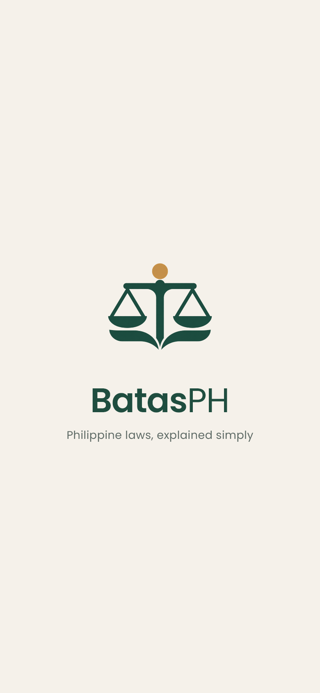
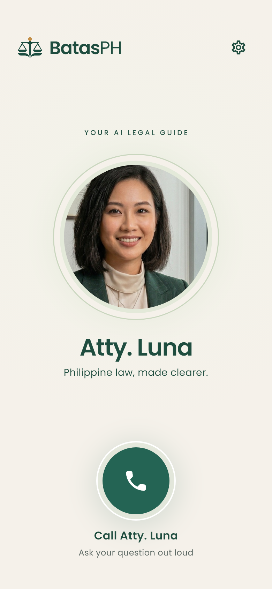
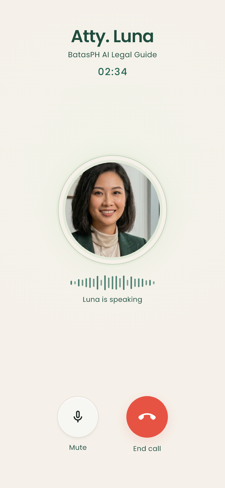
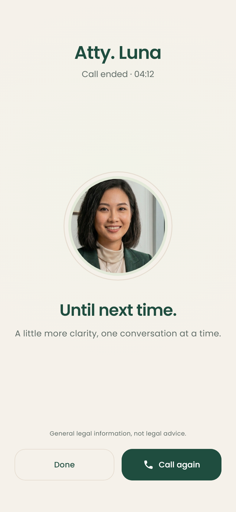

# Implemented design previews

These images render the actual Flutter widgets at 390 × 844 logical pixels, exported at 2×. Conversation data comes from test fixtures; these are not recordings of a live backend call. System status/navigation chrome is omitted.

| Splash | Home | Active call | Call ended |
| --- | --- | --- | --- |
|  |  |  |  |

The splash and home use the selected **03 / A clearer balance** identity. The call retains the portrait, warm canvas, animated voice indicator, and familiar mute/end-call controls. It remains a mobile call screen.

## Reproduce

```sh
flutter test test/ui/call_design_test.dart --dart-define=WRITE_DESIGN_PREVIEWS=true
```

Tests exercise settings/call callbacks, mute, retry, hang-up, summary, Call again, Done, system-back navigation, lengthy errors, and layouts at small-phone and tablet sizes. Long error messages scroll while retry remains visible. Presentation tests use fake controllers; live microphone, audio routing, native launch screens and backend behavior require device testing.

Branding validation: Flutter analysis passed; all 41 repository tests passed; all 81 generated assets matched expected dimensions; iOS AppIcon exports use RGB without alpha; Android resources compiled with AAPT2. These checks do not establish Play Store release readiness.

## Conversation layout refinement

Mute and End call share a fixed horizontal row outside the scrolling content, with 40 logical pixels of bottom padding inside SafeArea. The empty error placeholder is removed. Actual errors remain readable in the scrollable content while End call stays reachable. No captions control is shown.

Call Ended shows the portrait, call duration, farewell, and Done / Call again actions. It does not display the last question, transcript, text field, or legal-basis card. Conversation processing and call lifecycle are unchanged.

The updated layout tests verify that End call is immediately reachable on all tested screen sizes and that its label remains at least 60 logical pixels above the screen edge with the fixture's 20-pixel bottom safe area. They also check that the ended screen does not expose question/transcript fields.
